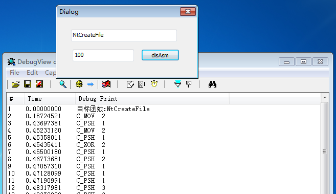

OD反汇编引擎的精简版本

作者 [thisIs](https://bbs.pediy.com/thread-140587.htm)

-

在x64位系统下使用了LDE64x64反汇编引擎，x86下还缺少一个引擎，搜索到这个。备份一份。

-

说明：

去掉了所有字串相关操作,也就是将不会有字串形式的参考信息;

指令表那里去掉了C_NOW,C_MMX,C_FLT

补充了测试demo，修改了定义。

#####OD反汇编引擎，只适合x86系统

-

用法：

使用上是与原版的OD相同的

添加头文件 disasm.h

参数一：Src:要反汇编的指令地址

参数二：SrcSize:指令长度

参数三：pDisasm:返回结构

ULONG DisasmCode(PUCHAR Src,ULONG SrcSize,PDisasm pDisasm)

 
 

 
 
 
 